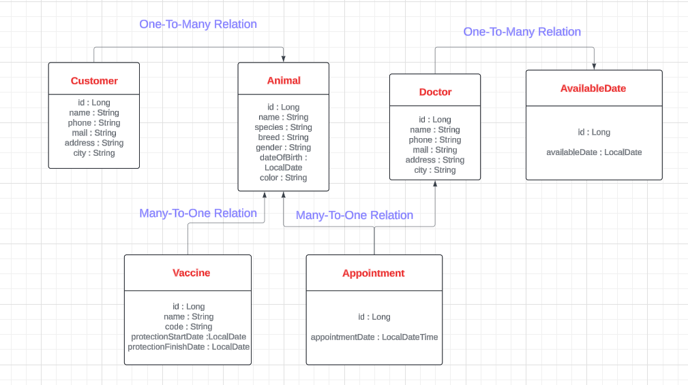

<h1 style="text-align:center; color: aquamarine"> VET MANAGEMENT SYSTEM  </h1>
 

<h2 style=" color: yellow"> Description Of The Vet Management System </h2>

 
This project was developed with Java version 17 and built in accordance with the N-Tier Architecture. 
Veterinary Management System is a web application designed to help veterinary clinics manage their daily operations.
This system allows veterinarians to record client and animal information, schedule appointments, keep track of vaccinations and do their reporting.

<a href="http://localhost:8080/swagger-ui/index.html#/">
    Swagger Web URL: http://localhost:8080/swagger-ui/index.html#/
</a>
  
<h2 style="color: #ff4d00;">
Technologies and Libraries
</h2>
<li style="font-size: large"> Spring Boot Framework </li>
<li style="font-size: large"> Spring Data JPA </li>
<li style="font-size: large"> Spring Web </li>
<li style="font-size: large"> Spring Boot Dev Tools</li>
<li style="font-size: large"> PostgreSQL </li>
<li style="font-size: large"> Lombok</li>
<li style="font-size: large"> Model Mapper</li>
<li style="font-size: large"> Swagger </li>
<li style="font-size: large"> Validation</li>

 
<h2> UML Diagram </h2>

<h2 style="text-align: center"> API Endpoints </h2>
<h3> Animal Endpoints </h3>

   | HTTP Method | Endpoint         | Request Body           | Response Body                       | Description                         |
   |-------------|------------------|------------------------|-------------------------------------|-------------------------------------|
   | POST        | /v1/animals      | AnimalSaveRequest      | ResultData<AnimalResponse>          | Create a new animal                 |
   | GET         | /v1/animals/{id} | -                      | ResultData<AnimalResponse>          | Get animal by ID                    |
   | GET         | /v1/animals/search | -                    | ResultData<List<AnimalResponse>>    | Search animals by name              |
   | GET         | /v1/animals      | -                      | ResultData<CursorResponse<AnimalResponse>> | Get paginated list of animals  |
   | PUT         | /v1/animals      | AnimalUpdateRequest    | AnimalResponse                      | Update an animal                    |
   | DELETE      | /v1/animals/{id} | -                      | Result                              | Delete an animal by ID              |

<h3> Appointment Endpoints </h3>

| HTTP Method | Endpoint                                   | Request Body                | Response Body                               | Description                                                      |
|-------------|--------------------------------------------|-----------------------------|---------------------------------------------|------------------------------------------------------------------|
| POST        | /v1/appointments                           | AppointmentSaveRequest      | ResultData<AppointmentResponse>             | Create a new appointment                                         |
| GET         | /v1/appointments/{id}                      | -                           | ResultData<AppointmentResponse>             | Get appointment by ID                                            |
| GET         | /v1/appointments/animalId                  | -                           | List<AppointmentResponse>                   | Get appointments by date range and animal ID                     |
| GET         | /v1/appointments/doctorId                  | -                           | List<AppointmentResponse>                   | Get appointments by date range and doctor ID                     |
| GET         | /v1/appointments                           | -                           | ResultData<CursorResponse<AppointmentResponse>> | Get paginated list of appointments                              |
| PUT         | /v1/appointments                           | AppointmentUpdateRequest    | AppointmentResponse                         | Update an appointment                                            |
| DELETE      | /v1/appointments/{id}                      | -                           | Result                                      | Delete an appointment by ID                                      |

<h3> Available Date Endpoints </h3>

| HTTP Method | Endpoint               | Request Body              | Response Body                          | Description                        |
|-------------|------------------------|---------------------------|----------------------------------------|------------------------------------|
| POST        | /v1/availableDates     | AvailableSaveRequest      | ResultData<AvailableDateResponse>      | Create a new available date        |
| GET         | /v1/availableDates/{id}| -                         | ResultData<AvailableDateResponse>      | Get available date by ID           |
| PUT         | /v1/availableDates     | AvailableUpdateRequest    | ResultData<AvailableDateResponse>      | Update an available date           |
| DELETE      | /v1/availableDates/{id}| -                         | Result                                | Delete an available date by ID     |

<h3> Customer Endpoints </h3>

| HTTP Method | Endpoint                          | Request Body               | Response Body                       | Description                              |
|-------------|-----------------------------------|----------------------------|-------------------------------------|------------------------------------------|
| POST        | /v1/customers                     | CustomerSaveRequest        | ResultData<CustomerResponse>        | Create a new customer                    |
| GET         | /v1/customers/{id}                | -                          | ResultData<CustomerResponse>        | Get customer by ID                       |
| GET         | /v1/customers/search              | -                          | ResultData<List<CustomerResponse>>  | Search customers by name                 |
| GET         | /v1/customers/{customerId}/animals| -                          | ResultData<List<AnimalResponse>>    | Get animals by customer ID               |
| GET         | /v1/customers                     | -                          | ResultData<CursorResponse<CustomerResponse>> | Get paginated list of customers   |
| PUT         | /v1/customers                     | CustomerUpdateRequest      | ResultData<CustomerResponse>        | Update a customer                        |
| DELETE      | /v1/customers/{id}                | -                          | Result                              | Delete a customer by ID                  |

<h3> Doctor Endpoints </h3>

| HTTP Method | Endpoint        | Request Body           | Response Body                       | Description                     |
|-------------|-----------------|------------------------|-------------------------------------|---------------------------------|
| POST        | /v1/doctors     | DoctorSaveRequest      | ResultData<DoctorResponse>          | Create a new doctor             |
| GET         | /v1/doctors/{id}| -                      | ResultData<DoctorResponse>          | Get doctor by ID                |
| GET         | /v1/doctors/all | -                      | ResultData<List<DoctorResponse>>    | Get all doctors                 |
| GET         | /v1/doctors     | -                      | ResultData<CursorResponse<DoctorResponse>> | Get paginated list of doctors   |
| PUT         | /v1/doctors     | DoctorUpdateRequest    | ResultData<DoctorResponse>          | Update a doctor                 |
| DELETE      | /v1/doctors/{id}| -                      | Result                              | Delete a doctor by ID           |

<h3> Vaccine Endpoints </h3>

| HTTP Method | Endpoint                               | Request Body               | Response Body                         | Description                                      |
|-------------|----------------------------------------|----------------------------|---------------------------------------|--------------------------------------------------|
| POST        | /v1/vaccines                           | VaccineSaveRequest         | ResultData<VaccineResponse>           | Create a new vaccine                             |
| GET         | /v1/vaccines/{id}                      | -                          | ResultData<VaccineResponse>           | Get vaccine by ID                                |
| GET         | /v1/vaccines/all                       | -                          | ResultData<List<VaccineResponse>>     | Get all vaccines                                 |
| GET         | /v1/vaccines                           | -                          | ResultData<CursorResponse<VaccineResponse>> | Get paginated list of vaccines                |
| GET         | /v1/vaccines/animal/{animalId}         | -                          | ResultData<List<VaccineResponse>>     | Get vaccines by animal ID                        |
| GET         | /v1/vaccines/date                      | -                          | ResultData<List<VaccineResponse>>     | Get vaccines by protection start date range      |
| PUT         | /v1/vaccines                           | VaccineUpdateRequest       | ResultData<VaccineResponse>           | Update a vaccine                                 |
| DELETE      | /v1/vaccines/{id}                      | -                          | Result                                | Delete a vaccine by ID                           |

 
<h2 style="color: yellow"> Application Video </h2>

 There is a detailed explanation of the project in the YouTube link below. 

https://www.youtube.com/watch?v=QaYFGMx9tKA

  

<h3 style="color: yellow"> Contact: </h3>

        <a href="mailto:ferhatseker180@gmail.com">ferhatseker180@gmail.com</a>
    

    

        <a href="https://github.com/ferhatseker180">https://github.com/ferhatseker180</a>
    

    

        <a href="https://www.linkedin.com/in/ferhat-%C5%9Feker-2410571a4/">https://www.linkedin.com/in/ferhat-%C5%9Feker-2410571a4/</a>
    
 
 

